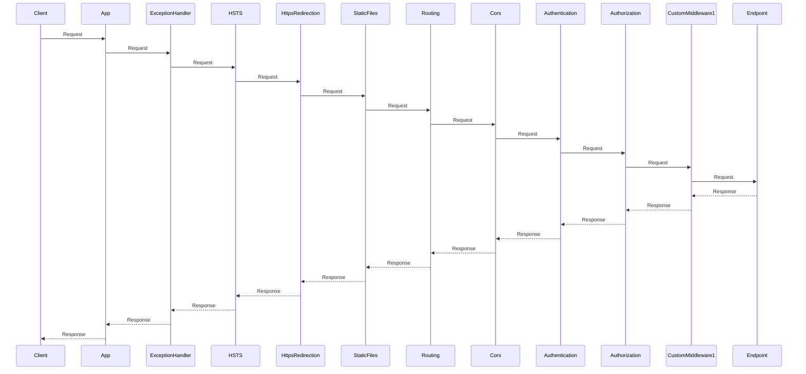

```mermaid
sequenceDiagram
    participant Client
    participant App
    participant ExceptionHandler
    participant HSTS
    participant HttpsRedirection
    participant StaticFiles
    participant Routing
    participant Cors
    participant Authentication
    participant Authorization
    participant CustomMiddleware1
    participant Endpoint

    Client->>App: Request
    App->>ExceptionHandler: Request
    ExceptionHandler->>HSTS: Request
    HSTS->>HttpsRedirection: Request
    HttpsRedirection->>StaticFiles: Request
    StaticFiles->>Routing: Request
    Routing->>Cors: Request
    Cors->>Authentication: Request
    Authentication->>Authorization: Request
    Authorization->>CustomMiddleware1: Request
    CustomMiddleware1->>Endpoint: Request
    Endpoint-->>CustomMiddleware1: Response
    CustomMiddleware1-->>Authorization: Response
    Authorization-->>Authentication: Response
    Authentication-->>Cors: Response
    Cors-->>Routing: Response
    Routing-->>StaticFiles: Response
    StaticFiles-->>HttpsRedirection: Response
    HttpsRedirection-->>HSTS: Response
    HSTS-->>ExceptionHandler: Response
    ExceptionHandler-->>App: Response
    App-->>Client: Response
```
