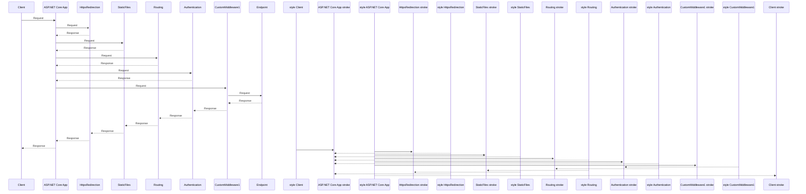

```mermaid
sequenceDiagram
    participant Client
    participant ASP.NET Core App
    participant HttpsRedirection
    participant StaticFiles
    participant Routing
    participant Authentication
    participant CustomMiddleware1
    participant Endpoint

    Client->>ASP.NET Core App: Request
    ASP.NET Core App->>+HttpsRedirection: Request
    HttpsRedirection-->>ASP.NET Core App: Response
    ASP.NET Core App->>+StaticFiles: Request
    StaticFiles-->>ASP.NET Core App: Response
    ASP.NET Core App->>+Routing: Request
    Routing-->>ASP.NET Core App: Response
    ASP.NET Core App->>+Authentication: Request
    Authentication-->>ASP.NET Core App: Response
    ASP.NET Core App->>+CustomMiddleware1: Request
    CustomMiddleware1->>Endpoint: Request
    Endpoint-->>CustomMiddleware1: Response
    CustomMiddleware1-->>Authentication: Response
    Authentication-->>Routing: Response
    Routing-->>StaticFiles: Response
    StaticFiles-->>HttpsRedirection: Response
    HttpsRedirection-->>ASP.NET Core App: Response
    ASP.NET Core App-->>Client: Response

    %% set style for request pipeline
    style Client->>ASP.NET Core App stroke:#4F81BD,stroke-width:3px;
    style ASP.NET Core App->>+HttpsRedirection stroke:#4F81BD,stroke-width:3px;
    style HttpsRedirection-->>ASP.NET Core App stroke:#4F81BD,stroke-width:3px;
    style ASP.NET Core App->>+StaticFiles stroke:#4F81BD,stroke-width:3px;
    style StaticFiles-->>ASP.NET Core App stroke:#4F81BD,stroke-width:3px;
    style ASP.NET Core App->>+Routing stroke:#4F81BD,stroke-width:3px;
    style Routing-->>ASP.NET Core App stroke:#4F81BD,stroke-width:3px;
    style ASP.NET Core App->>+Authentication stroke:#4F81BD,stroke-width:3px;
    style Authentication-->>ASP.NET Core App stroke:#4F81BD,stroke-width:3px;
    style ASP.NET Core App->>+CustomMiddleware1 stroke:#4F81BD,stroke-width:3px;

    %% set style for response pipeline
    style CustomMiddleware1-->>Authentication stroke:#8CBF41,stroke-width:3px;
    style Authentication-->>Routing stroke:#8CBF41,stroke-width:3px;
    style Routing-->>StaticFiles stroke:#8CBF41,stroke-width:3px;
    style StaticFiles-->>HttpsRedirection stroke:#8CBF41,stroke-width:3px;
    style HttpsRedirection-->>ASP.NET Core App stroke:#8CBF41,stroke-width:3px;
    style ASP.NET Core App-->>Client stroke:#8CBF41,stroke-width:3px;

```
