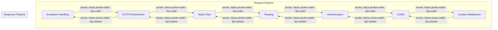

```mermaid
graph TD;
    subgraph Request Pipeline
    A[Exception Handling] -->|stroke: black,stroke-width: 3px;solid| B[HTTPS Redirection];
    B -->|stroke: black,stroke-width: 3px;solid| C[Static Files];
    C -->|stroke: black,stroke-width: 3px;solid| D[Routing];
    D -->|stroke: black,stroke-width: 3px;solid| E[Authentication];
    E -->|stroke: black,stroke-width: 3px;solid| F[CORS];
    F -->|stroke: black,stroke-width: 3px;solid| G[Custom Middleware];
    end;
    
    subgraph Response Pipeline
    G -->|stroke: black,stroke-width: 3px;dotted| F;
    F -->|stroke: black,stroke-width: 3px;dotted| E;
    E -->|stroke: black,stroke-width: 3px;dotted| D;
    D -->|stroke: black,stroke-width: 3px;dotted| C;
    C -->|stroke: black,stroke-width: 3px;dotted| B;
    B -->|stroke: black,stroke-width: 3px;dotted| A;
    end;
```
