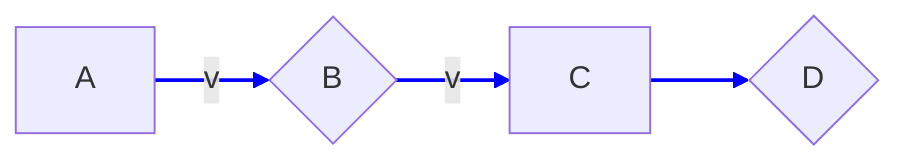

```mermaid
graph LR;
        A--v-->B{B}
        B-->|v|C[C]
         C-->D{D};

        linkStyle 0 stroke-width:2px,fill:none,stroke:blue;
        linkStyle 1 stroke-width:2px,fill:none,stroke:blue;
        linkStyle 2 stroke-width:2px,fill:none,stroke:blue;
```
