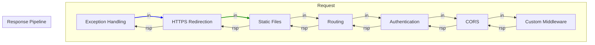

```mermaid
graph TD;
    subgraph Request 
    A[Exception Handling] -->|in| B[HTTPS Redirection];
    B -->|in| C[Static Files];
    C -->|in| D[Routing];
    D -->|in| E[Authentication];
    E -->|in| F[CORS];
    F -->|in| G[Custom Middleware];
       linkStyle 0 stroke-width:2px,fill:none,stroke:blue;
    end;
    
    subgraph Response Pipeline
    G -->|rsp| F;
    F -->|rsp| E;
    E -->|rsp| D;
    D -->|rsp| C;
    C -->|rsp| B;
    B -->|rsp| A;
            linkStyle 1 stroke-width:2px,fill:none,stroke:green;
    end;
```
  

