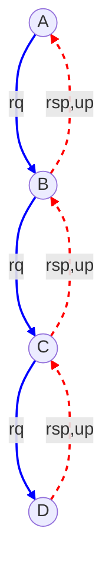

```mermaid
graph TD;
    A((A))-->|rq|B((B))
    B-->|rq|C((C))
    C-->|rq|D((D))
    D--->|rsp,up|C
    C--->|rsp,up|B
    B--->|rsp,up|A

    linkStyle 0 stroke-width:2px,fill:none,stroke:blue;
    linkStyle 1 stroke-width:2px,fill:none,stroke:blue;
    linkStyle 2 stroke-width:2px,fill:none,stroke:blue;
    linkStyle 3 stroke-dasharray: 5 5, stroke-width:2px,fill:none,stroke:red;
    linkStyle 4 stroke-dasharray: 5 5, stroke-width:2px,fill:none,stroke:red;
    linkStyle 5 stroke-dasharray: 5 5, stroke-width:2px,fill:none,stroke:red;


```
