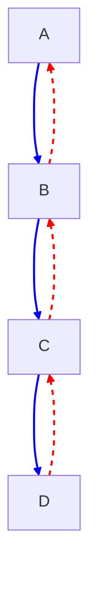

```mermaid
graph TD;
    A -->B
    B-->C
    C-->D
    D--->C
    C--->B
    B--->A

    linkStyle 0 stroke-width:2px,fill:none,stroke:blue;
    linkStyle 1 stroke-width:2px,fill:none,stroke:blue;
    linkStyle 2 stroke-width:2px,fill:none,stroke:blue;
    linkStyle 3 stroke-dasharray: 5 5, stroke-width:2px,fill:none,stroke:red;
    linkStyle 4 stroke-dasharray: 5 5, stroke-width:2px,fill:none,stroke:red;
    linkStyle 5 stroke-dasharray: 5 5, stroke-width:2px,fill:none,stroke:red;

```
